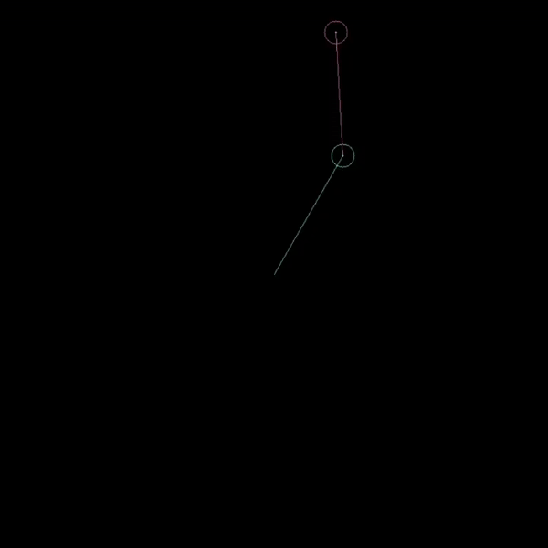

# DoublePendulumSim
A double pendulum simulation implemented in Python. It uses OpenCV for rendering. The size of a circle in the middle of a bob (weighted end of a pendulum) indicates it's angular velocity. Math implementation adapted from Daniel Shiffman on Youtube (https://www.youtube.com/watch?v=uWzPe_S-RVE)

Example:

